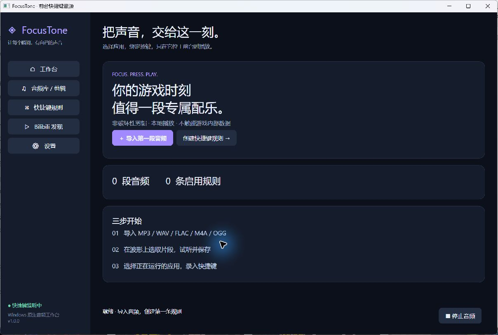
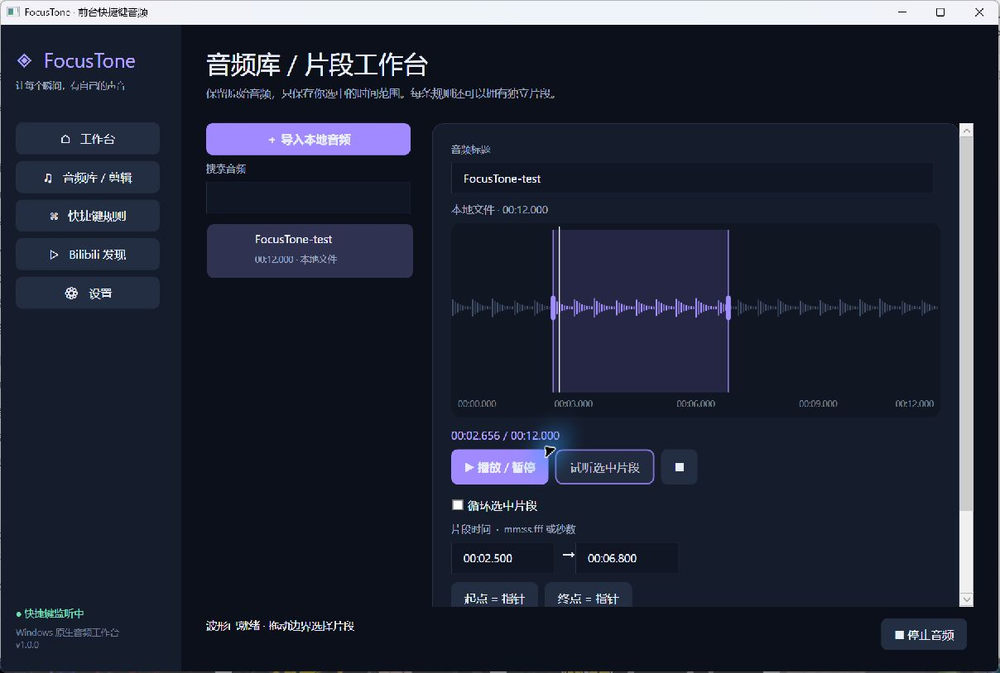

# FocusTone

**让指定应用里的一个按键，触发你自己的声音片段。**

FocusTone 是面向 Windows 的本地快捷键音频工作台。选择目标 EXE、导入音频、拖出片段、绑定按键：只有目标程序的窗口处于前台，规则才会触发。切到其他应用，同一个按键不会触发这条规则。

例如：`r5apex.exe → Z → 我的配乐 [01:12.500 – 01:26.800]`。软件不包含示例中的商业音乐，也不需要访问游戏内部数据。

> 本仓库是公开版本。Bilibili 使用官方页面搜索与播放，没有平台音频提取或下载功能。“导入已有授权音频”只选择本地文件。详见[版权与安全范围](SECURITY.md)。

## 界面

实际运行截图；编辑器中使用本地生成的原创测试音调。




## 功能

- **应用绑定**：枚举可访问的运行进程，显示应用名、进程名、完整 EXE 路径和图标；也可以直接选择 EXE。规则按路径保存，不绑定临时 PID。
- **快捷键**：单键、Ctrl / Shift / Alt 组合键、Mouse4 / Mouse5；按住去重，不拦截按键原有用途；后台和托盘状态继续监听。
- **本地音频库**：MP3、WAV、FLAC、M4A、OGG Vorbis；标题、封面、来源、时长、搜索、重命名和删除；导入为独立副本。
- **非破坏性片段**：波形、时间刻度、点击 / 拖动定位、拖动左右边界、毫秒输入、指针设起点 / 终点、暂停、循环片段、一键试听。
- **独立规则**：每条规则单独保存片段，支持启停、编辑、更换音频、测试播放和删除；同一应用不能重复绑定同一个快捷键。
- **播放行为**：重播同一规则、忙时忽略、停止当前音频并替换。
- **系统托盘**：打开、暂停全部快捷键、停止音频、退出。
- **设置**：开机启动、最小化到托盘、音量、输出设备、监听开关、官方网页开关、数据目录查看和缓存清理。
- **持久化和诊断**：版本化 JSON、原子保存、自动备份恢复、有限日志保留。

## 系统要求

- Windows 10 / 11 x64；建议 Windows 11。
- 正常可用的 Windows 音频输出设备。
- 便携 Release 包包含 .NET Runtime，不需要另装 .NET。
- 从源码构建需要 **.NET 10 SDK**（仅有 Runtime 不够）。
- Bilibili 内嵌页面需要 [Microsoft Edge WebView2 Evergreen Runtime](https://developer.microsoft.com/microsoft-edge/webview2/)。未安装时仍可使用全部本地功能，或在外部浏览器访问官网。
- M4A / FLAC / MP3 由 Windows Media Foundation 解码。Windows N 版本可能需要 Media Feature Pack；受 DRM 保护或不受系统支持的编码不能导入。OGG 此处指 Vorbis，不是所有 Ogg 容器编码。

## 安装与运行

1. 在仓库的 **Releases** 中下载 `FocusTone-win-x64.zip`。
2. 将整个压缩包解压到一个固定目录。不要仅提取 EXE；需要旁边的 DLL、运行时和许可证文件。
3. 双击 `FocusTone.exe`。无需管理员权限。
4. 默认关闭主窗口会留在托盘；完全结束程序使用托盘菜单“退出”。

首次公开构建未进行商业代码签名。请核对来源与随附 SHA-256，不要关闭系统安全防护。若系统策略不允许运行，可自行审查源码构建。

更新前从托盘退出，解压新版本到新目录。音频与规则保存在用户数据目录，不随程序目录变化。若曾开启自动启动，迁移程序后在新位置重新保存设置。删除程序目录即可移除便携应用；用户数据不会自动删除。

## 三分钟上手

### 1. 导入音频

打开“音频库 / 剪辑”，选择“导入本地音频”。仅导入自己创作或已经取得所需授权的文件。导入会复制文件；移动原始文件不会让已导入内容失效。

可用以下脚本生成一段原创测试音调，无需寻找音乐素材：

```powershell
./scripts/New-TestTone.ps1
```

生成文件位于 `artifacts/FocusTone-test.wav`，不会进入 Git。

### 2. 选择片段

选中音频，等待后台波形分析完成。拖动紫色左右边界，或者输入 `01:12.500` 和 `01:26.800`。点击波形移动指针；“起点 = 指针”“终点 = 指针”可快速标记。

“播放 / 暂停”用于整段音频或当前播放的暂停与继续；“试听选中片段”从片段起点开始播放，可勾选循环。点击“保存标题与片段”保存该音频的默认片段。已有规则的独立片段不会被覆盖。

### 3. 绑定应用和按键

打开目标应用，再点“绑定快捷键”或进入“快捷键规则 → 创建规则”。输入应用名筛选，选择正确 EXE，检查路径。选择音频、录入或输入快捷键，设置独立时间范围并保存。

切回目标应用后按键。要检查后台工作，可将 FocusTone 最小化到托盘再测试。规则管理页的“测试播放”不要求目标应用在前台，仅验证音频与片段。

## 触发行为

| 行为 | 结果 |
|---|---|
| 重新播放同一规则 | 同一规则从起点重播；其他规则正在播放或暂停时忽略 |
| 忙时忽略 | 任意音频播放或暂停时不启动新音频 |
| 停止当前后播放新音频 | 停止之前的声音，再播放触发规则 |

应用使用单一播放通道，不做多轨混音。修饰键严格匹配：`Z` 和 `Ctrl+Z` 是不同规则。Win 键组合不支持。Mouse4 / Mouse5 指标准鼠标侧键；鼠标驱动若将其改映射为键盘键，应绑定映射后的按键。

## 快捷键如何工作

使用 Windows **Raw Input** 接收键盘 / 鼠标事件。独立消息线程处理输入，不让高频鼠标消息占用界面线程；按下与抬起边缘用于抑制自动重复。只有按键匹配规则时才查询当前前台窗口的进程路径，不高频轮询前台窗口。

没有 DLL 注入、`SetWindowsHookEx`、游戏内存访问、游戏文件修改或反作弊绕过。按键不会被吞掉，游戏自身仍会收到同一按键。对特定游戏或反作弊产品的兼容性不能作保证；发布验收不等于实际 Apex 对局验证。

完整 EXE 路径匹配避免同名程序误触发。重启游戏不影响规则；游戏更新后安装路径变化则需要重新选择 EXE。受保护、权限更高或不公开路径的进程可能无法识别，软件会保持不触发。

## Bilibili 功能与版权

公开版在独立 WebView2 中打开 **未修改的官方网页**：输入关键词显示官方搜索结果，输入 BV 号打开对应视频。标题、UP 主、封面、时长、分 P、播放和登录均由官方页面提供。

- 不提取音频地址、不下载 / 转码视频，不导出网页登录 Cookie。
- 不移除广告、不突破会员、付费、地域或 DRM 限制。
- “导入已有授权音频”打开本地文件选择框，不会把当前视频抓取到音频库。
- 访问失败时可使用“在浏览器打开”；平台限制会保留，不自动规避。
- 网页浏览可能由 WebView2 产生正常浏览缓存，这不等于音频导出；此目录不进入源代码或 Release。

公开播放、个人使用、短片段均不自动代表取得授权。直播、录播、公开播放及再分发可能需要额外许可。项目不附带第三方音乐；使用者需要保留素材来源和授权凭证。上述设计降低风险，但不是法律意见或无侵权保证。

调研过的开源实现与最终取舍见 [DEPENDENCIES.md](docs/DEPENDENCIES.md)。本项目与 Bilibili、游戏厂商无隶属或官方合作关系。

## 从源码编译

安装 [Git](https://git-scm.com/) 和 [.NET 10 SDK](https://dotnet.microsoft.com/download/dotnet/10.0)，在 Windows PowerShell / 终端运行：

```powershell
git clone https://github.com/dingz1hao/FocusTone.git
cd FocusTone
dotnet restore FocusTone.sln
dotnet build FocusTone.sln -c Release
dotnet test FocusTone.sln -c Release
dotnet run --project src/FocusTone/FocusTone.csproj -c Release
```

不要同时运行多个实例。编译前退出旧实例，否则 DLL / EXE 可能被锁定。

### 生成可分发版本

```powershell
./scripts/Check-PublicSource.ps1
./scripts/Publish.ps1
```

输出在 `artifacts/FocusTone-win-x64/`，压缩包在 `artifacts/FocusTone-win-x64.zip`。脚本会先运行测试，失败则不发布；发布包含自带 .NET Runtime、独立依赖 DLL、第三方许可证及 TagLibSharp 对应源码。发布阶段需要网络下载许可证和对应源码。

也可自行执行：

```powershell
dotnet publish src/FocusTone/FocusTone.csproj -c Release -r win-x64 --self-contained true -p:PublishSingleFile=false -p:PublishTrimmed=false -o artifacts/local
```

手动发布时必须一并提供第三方许可证和 LGPL 对应源码，不应只分发 EXE。仓库的 Windows CI 会构建、测试并生成可下载的构建产物。

## 数据位置

默认 `%LOCALAPPDATA%\FocusTone`：

```text
settings.json        设置、音频元数据与规则
settings.json.bak    上次有效配置备份
library/             导入的音频副本与封面
cache/               可重建的波形缓存
logs/                最近七个日志文件
WebView2/            官方网页独立浏览器数据（可能含登录状态）
```

可用环境变量 `FOCUSTONE_DATA_DIR` 指定绝对路径。迁移前退出软件，复制整个数据目录，再设置变量并重启。不要把此目录上传 GitHub；尤其不要分享 `WebView2/`。

清理缓存不删除音频库或规则，也不清除网页登录状态。要备份本地工作，保存 `settings.json`、`.bak` 和 `library/` 即可。

## 项目结构

```text
src/FocusTone/
  Audio/          解码、WASAPI 输出、采样边界片段、波形分析
  Controls/       可拖动波形时间轴
  Models/         持久化模型与时间校验
  Native/         Raw Input、前台与运行进程识别
  Providers/      Bilibili 官方导航接口与实现
  Services/       音频库、规则引擎、存储、日志、托盘
  Views/          音频库、规则编辑、官方网页、设置
  App.xaml        深色样式与入口
  MainWindow.cs   主界面及服务生命周期
tests/            时间、音频帧、存储恢复、导入、导航边界测试
scripts/          测试音频、发布与公开源码边界检查
docs/             架构、依赖决策、验收记录、真实截图
.github/workflows/Windows CI
```

技术栈和许可详情见 [第三方声明](THIRD-PARTY-NOTICES.md)、[依赖调查](docs/DEPENDENCIES.md) 与[架构说明](docs/ARCHITECTURE.md)。

## 常见问题

**没有声音？** 先在库中试听，检查应用音量、Windows 音量混合器和输出设备。拔出 USB / 蓝牙设备后，重新选择设备并开始播放。默认设备在每次新播放时重新解析。

**按键不触发？** 确认总开关与规则已启用、目标窗口在前台、EXE 路径正确、没有多按修饰键。按键录入窗口打开时临时暂停规则。不要仅凭进程名判断是否是正确目标。

**关闭窗口后为什么还在运行？** 默认关闭到托盘。托盘“退出”才真正退出；可在设置里关闭此行为。

**波形第一次加载慢？** 首次必须解码整个文件来计算峰值，在后台完成并缓存。软件允许最长 4 小时音频，超长文件建议先使用专用编辑器处理。

**能把音乐发给语音队友吗？** 软件向所选输出设备播放。它不创建虚拟麦克风，不修改游戏音频，也不自动把声音混入语音输入。

**为什么不用全局注册 Z？** 全局注册单键会干扰应用正常输入；Raw Input 只接收事件，不抢占游戏按键。

**数据损坏？** 启动会保留损坏文件副本并尝试 `.bak`。若备份也不可用，先保留现有目录，再人工恢复；程序不会静默清空数据。

## 已知限制

- Windows x64 为当前发布目标；ARM64、触屏编辑、无障碍波形键盘操作未完成专项验证。
- 深色主题为默认；没有自动浅色主题切换。
- 单通道播放，不支持多轨混音、淡入淡出或导出剪辑文件。
- 默认片段和规则片段相互独立；修改音频默认片段不会批量改变规则。
- 压缩文件的定位精度受解码器影响；时间显示达到毫秒不等于所有硬件都能达到毫秒触发延迟。
- 游戏路径或权限改变可能导致规则暂不匹配；不承诺对所有反作弊环境兼容。
- WebView2 页面有额外内存消耗；离开页面将关闭网页播放并释放控件。
- Bilibili 官方 UI、访问策略和运行时兼容性由第三方控制。
- 没有自动更新器或签名安装程序；提供完整便携包与可重复构建脚本。

具体已执行和未执行的检查见 [TESTING.md](docs/TESTING.md)。

## Roadmap

- 波形缩放、键盘无障碍编辑与更丰富的标记。
- 短音频预解码缓存及真实硬件触发延迟基准。
- 规则导入 / 导出、批量迁移 EXE 路径。
- 多主题与签名安装包。
- 更广泛的设备热插拔、游戏全屏与 ARM64 兼容测试。

## License

应用源码采用 [MIT](LICENSE)。NAudio / NVorbis 为 MIT；TagLibSharp 为 LGPL-2.1-only；WebView2 使用微软 SDK 许可。依赖许可不因本项目采用 MIT 而改变。第三方音视频内容不包含在本软件许可范围内。
